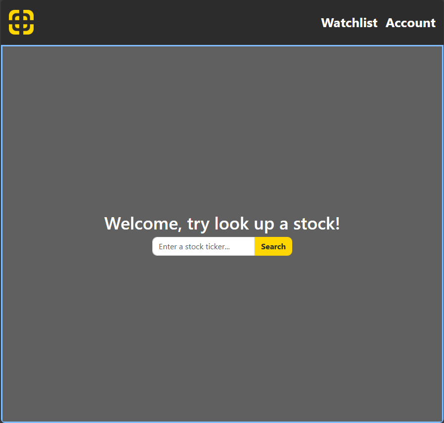
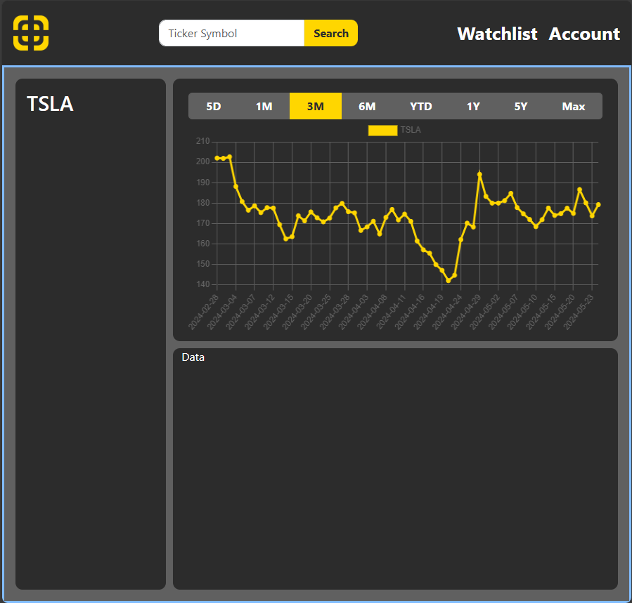

# Project_Goblin
The goal of this project is to create an analyze tool for the stock market. It is still in active development 

## Implemented Features
- Grab historical stock data and displays them on screen
- Store stock data into local MongoDB server

## Installation
- Install Python 3.11+
- Install Django 5.0.1
- Install MongoDB Compass 1.43.0

Start the website, make sure you cd into the backend/ and start the server:
```console
$ cd backend/
$ python manage.py runserver
Watching for file changes with StatReloader
Performing system checks...

System check identified no issues (0 silenced).
May 27, 2024 - 00:36:44
Django version 5.0.1, using settings 'stockAnalyzer.settings'
Starting development server at http://127.0.0.1:8000/
Quit the server with CTRL-BREAK.
```
After that, go to your browser and go to http://127.0.0.1:8000/ to view the website

## How it looks right now



## Future Implementation
- Add accounts and watchlist
- Grab data from gov websites
- Add a Neural Network using stock data and economic data to predict up coming stock movement
